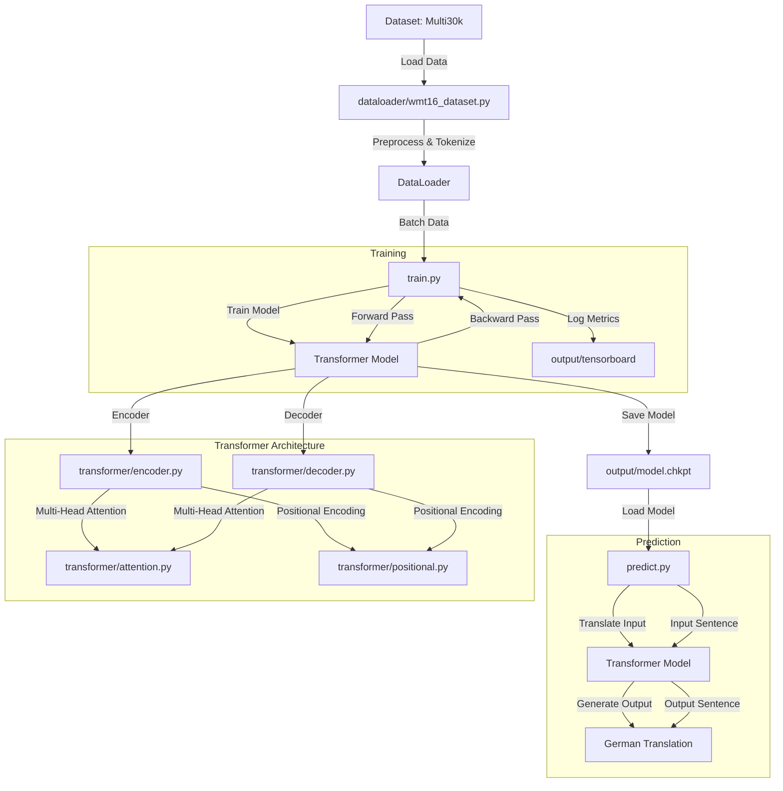

# Attention Is All You Need
###### Ashish Vaswani, Noam Shazeer, Niki Parmar, Jakob Uszkoreit, Llion Jones, Aidan N. Gomez, Lukasz Kaiser, Illia Polosukhin

### Reimplementation of the paper [Attention Is All You Need](https://arxiv.org/abs/1706.03762) in PyTorch.

## Dataset
- [Multi30k](https://pytorch.org/text/stable/datasets.html#multi30k) - Based on [WMT16](https://www.statmt.org/wmt16/multimodal-task.html#task1).
    - Train 29000
    - Valid 1014
    - Test 1000

- Overview
    ```
    English: an older man is playing a video arcade game.
    German: ein älterer mann spielt ein videospiel.
        
    English: a man is talking on a cellphone outside.
    German: ein mann telefoniert im freien mit dem handy.
    ```

## Requirements
- `pip install -r requirements.txt`
- Download the tokenizer
  - `python -m spacy download de_core_news_sm`
  - `python -m spacy download en_core_web_sm`

## Usage
- Train the model
  ```
  Default:
  python train.py
  
  Custom:
  python train.py [-h]
  [--batch_size BATCH_SIZE]
  [--emb_size EMB_SIZE]
  [--num_heads NUM_HEADS]
  [--dropout DROPOUT]
  [--epoch EPOCH]
  [--n_layers N_LAYERS]
  ```
- Translate English to German
  ```
  Default:
  python predict.py
  
  Custom:
  python predict.py [-h]
  [--inp INP]
  ```
  
## Result
- The model was trained on 4 `NVIDIA A100-SXM-80GB` GPUs with each GPU of 4 cores/gpu and 8 GB/core specifications.

  | Task              | BLEU Score        |
  |-------------------|-------------------|
  | English to German | 29.4              |

## Structure
```
.wmt16_data/ - [Dataset]
dataloader/ - [Data preprocessing pipeline and tokenization]
logs/ - [Logs of run]
output/
  tensorboard/ - [Visualization toolkit files]
docs/ - [Project report and presentation]
transformer/ - [Transformer Architecture]
  attention.py
  decoder.py
  encoder.py
  optim.py
  positional.py
  transformer.py
predict.py - [Translation file]
train.py - [Training file]
```

## Flowchart


## Visualization
`tensorboard --logdir output`

## Future Task
Implement machine translation on English to Hindi
- Dataset - [IIT Bombay Hindi English Corpus](https://www.cfilt.iitb.ac.in/iitb_parallel/).
- Hindi Tokenizer - [Indic NLP Library](http://anoopkunchukuttan.github.io/indic_nlp_library/).

## References
- The byte pair encoding parts are borrowed from [subword-nmt](https://github.com/rsennrich/subword-nmt/).
- The project structure, some scripts are partly borrowed from [jadore801120/attention-is-all-you-need-pytorch](https://github.com/jadore801120/attention-is-all-you-need-pytorch).
- Andrej Karpathy youtube video "[Let's build GPT: from scratch, in code, spelled out](https://www.youtube.com/watch?v=kCc8FmEb1nY)".
- Aladdin Persson youtube video "[Pytorch Transformers](https://www.youtube.com/watch?v=U0s0f995w14)".
- "[The Illustrated Transformer](https://jalammar.github.io/illustrated-transformer/)" by Jay Alammar.
- PyTorch tutorial "[LANGUAGE TRANSLATION WITH NN.TRANSFORMER AND TORCHTEXT](https://pytorch.org/tutorials/beginner/translation_transformer.html)".

## Acknowledgement
```
@article{vaswani2017attention,
      title={Attention Is All You Need}, 
      author={Ashish Vaswani and 
          Noam Shazeer and 
          Niki Parmar and 
          Jakob Uszkoreit and 
          Llion Jones and 
          Aidan N. Gomez and 
          Lukasz Kaiser and 
          Illia Polosukhin},
      year={2017},
      eprint={1706.03762},
      archivePrefix={arXiv},
      primaryClass={cs.CL}
      url={https://arxiv.org/abs/1706.03762}
}
```
